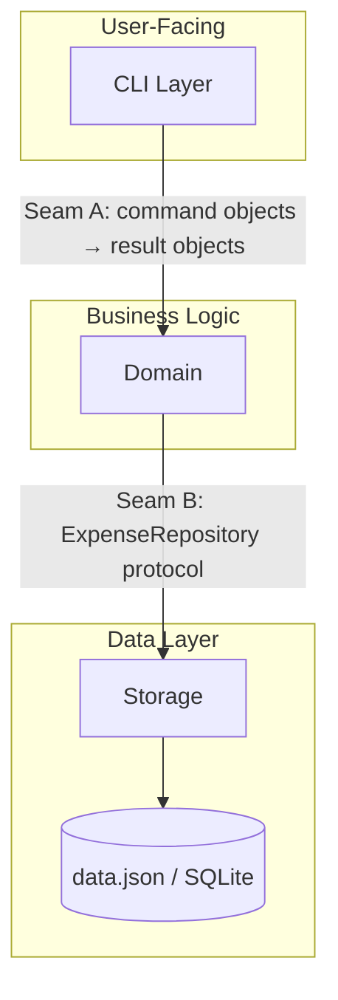

# SYSTEM_MAP — Expense Tracker CLI

## Overview

個人命令列記帳工具，解決「記事本記帳容易找不到」的問題（goals.md）。單人本機使用，無並發需求，估算日寫入 3-10 次（D1），日讀取 1-2 次（D2）。純 Python CLI，資料儲存格式待定（OQ1）。目前狀態：初始設計階段（無現成程式碼）。

## Component Map

| Component | Responsibility | Owns | Status |
|-----------|---------------|------|--------|
| [CLI Layer](src/expense_tracker/cli.py) | 解析命令列引數，格式化輸出至 stdout | 無（無狀態） | Planned |
| [Domain](src/expense_tracker/domain.py) | 業務邏輯：驗證、過濾、計算匯總 | 驗證規則、分類存在性規則 | Planned |
| [Storage](src/expense_tracker/storage.py) | 持久化讀寫（抽象介面） | 資料檔案 | Planned |

## Boundary Map

### Seam A: CLI ↔ Domain (driven by D1, D2)
- **Connects**: CLI Layer → Domain
- **Direction**: one-way request + response（CLI 呼叫 Domain method，Domain 回傳結果）
- **Contract**: Domain 函式簽名 + Pydantic result models（待 ec:align-internals 定義）
- **Change impact**: 任何 Domain 函式介面改動都需同步更新 CLI Layer
- **Where to look**: `src/expense_tracker/domain.py` interface section

### Seam B: Domain ↔ Storage (driven by D1, AP1, AP4)
- **Connects**: Domain → Storage
- **Direction**: Domain 發出讀寫請求，Storage 執行，回傳結果或 raise exception
- **Contract**: `ExpenseRepository` Protocol（待 ec:align-internals 定義）
- **Change impact**: Storage 實作可替換（JSON ↔ SQLite），Domain 不應改動
- **Where to look**: `src/expense_tracker/storage.py` + `src/expense_tracker/protocols.py`

## Current State

- **Phase**: 初始設計（無現成程式碼）
- **In-flight**: 無
- **Gaps**:
  - Seam A 合約未定義（ec:align-internals 待處理）
  - Seam B 合約未定義（ec:align-internals 待處理）
  - Storage 格式尚未決定（OQ1：JSON vs SQLite）
  - 所有 G1-G4 功能尚未實作

## Lessons

<!-- Populated by ec:design-review Lessons Capture; empty at initial creation -->

## Change Protocol

### Type 1: Goal Change
1. 重新評估 dominant-ops.md 的壓力排序是否改變
2. 確認 Seam A / Seam B 是否需要移動邊界
3. 建立 OpenSpec change 處理實作工作
4. 完成後更新 SYSTEM_MAP

### Type 2: Contract/Boundary Change (medium impact)
1. 識別 Seam A 或 Seam B 兩側的所有元件
2. 同步更新 producer 和 consumer（或進行版本控制）
3. 更新兩側測試
4. 更新 SYSTEM_MAP Boundary Map 對應條目

### Type 3: Internal Component Change (smallest impact)
1. 確認輸出合約不變
2. 更新內部測試
3. 不需要更新 SYSTEM_MAP（除非 Status 改變）

### Type 4: New Component Addition
1. 定義與現有元件的合約（碰到哪些 Seam？）
2. 加入 Component Map（表格和 Mermaid 圖）
3. 加入新 Boundary 到 Boundary Map
4. 若影響 CLI 指令，更新 Seam A 合約
