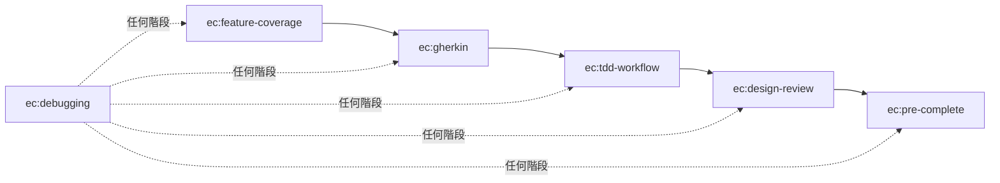

# spec-to-quality — Agent Guide

這套 skills 實現「從規格到品質」的 Python TDD 開發流程。

## Skill 執行順序

## 規則

- **不可跳步**：每個 skill 有前置條件，必須滿足才能進入下一個
- **測試/lint/type check 命令**：一律參照專案 CLAUDE.md 的 Commands 區段，不要假設任何特定工具
- **等待使用者確認**：ec:feature-coverage 分析完、ec:tdd-workflow 紅燈確認、都需要使用者明確同意才能繼續
- **ec:debugging 可在任何階段觸發**：遇到 bug 或測試失敗時，暫停當前流程進入 ec:debugging

## Skill 銜接說明

| 從 | 到 | 銜接方式 |
|----|-----|---------|
| ec:feature-coverage | ec:gherkin | 覆蓋率分析確認後，直接觸發 ec:gherkin skill 撰寫 .feature |
| ec:gherkin | ec:tdd-workflow | .feature 撰寫完成後，提醒使用者可以開始實作 |
| ec:tdd-workflow | ec:design-review | 綠燈 + refactor 完成後，提醒可以觸發 ec:design-review |
| ec:design-review | ec:pre-complete | review 完成後，如果要 commit/PR，觸發 ec:pre-complete |
| 任何階段 | ec:debugging | 測試失敗或遇到 bug 時自動觸發 |

## 前置要求

此 plugin 假設專案的 CLAUDE.md 包含以下區段：

- **Commands**：定義測試、lint、format、type check 的具體命令
- **Feature Scenario 具體化對應表**（選用）：將 6 類通用 scenario 類別對應到專案特定概念
